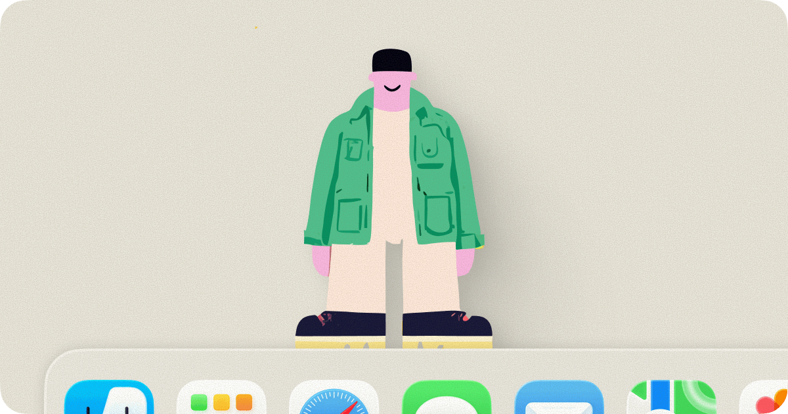

# lil agents



> 两个小家伙住在你的桌面上。它们散步、思考、发呆——然后在你需要的时候，变成你的 AI 终端。

**Bruce** 和 **Jazz**，两位微型 AI 伙伴，在你的 Dock / 任务栏上方悠闲地来回踱步。点击它们，一个漂亮的聊天终端就会弹出来——背后连接着真正的 AI CLI。

它们不只是装饰。它们是入口。

## 为什么做这个

每天都要和 AI 对话，但终端窗口总是被埋在一堆标签页下面。

我想要一个 **永远在那里** 的东西——不用 Alt+Tab、不用找窗口、不用切工作区。就像桌面上的一个小朋友，随时可以聊两句。

于是 Bruce 和 Jazz 诞生了。

## 平台支持

| 平台 | 技术栈 | 状态 |
|------|--------|------|
| **macOS** | Swift / SwiftUI / Xcode | ✅ 原版 |
| **Windows** | Electron 28 / Node.js | ✅ 移植版 |

**[下载 macOS 版](https://lilagents.xyz)** · [官网](https://lilagents.xyz)

## 功能一览

**角色与动画**
- 透明背景的角色动画（macOS: HEVC / Windows: WebM）
- 在 Dock / 任务栏上方自主来回走动
- AI 工作时头顶冒出思考气泡，配上俏皮的短语

**AI 聊天终端**
- 点击角色即可弹出主题化的聊天窗口
- 支持 **Claude Code** / **OpenAI Codex** / **GitHub Copilot** / **Google Gemini** CLI
- 从菜单栏 / 托盘自由切换 AI 后端
- 斜杠命令：`/clear`、`/copy`、`/help`
- 一键复制上次回复

**个性化**
- 四套视觉主题：🍑 Peach · 🌙 Midnight · ☁️ Cloud · 🌿 Moss
- 每个角色可独立设置主题
- 完成提示音效（可开关）

**Windows 版额外功能**
- 🎙️ 语音输入（本地 ASR 语音识别服务）

## 环境要求

**macOS**
- macOS Sonoma 14.0+（含 Sequoia 15.x）
- Universal Binary — Apple Silicon & Intel 原生运行

**Windows**
- Windows 10 / 11
- Node.js 18+

**至少安装一个 AI CLI：**

| CLI | 安装命令 |
|-----|---------|
| [Claude Code](https://claude.ai/download) | `curl -fsSL https://claude.ai/install.sh \| sh` |
| [OpenAI Codex](https://github.com/openai/codex) | `npm install -g @openai/codex` |
| [GitHub Copilot](https://github.com/github/copilot-cli) | `brew install copilot-cli` |
| [Google Gemini CLI](https://github.com/google-gemini/gemini-cli) | `npm install -g @google/gemini-cli` |

## 构建

**macOS** — 打开 `lil-agents.xcodeproj`，Xcode 点 Run 即可。

**Windows** — 进入 `lil-agents-win/` 目录：
```bash
npm install
npm start
```

## 项目结构

```
lil-agents-main/
├── LilAgents/                # macOS 原版 (Swift)
│   ├── LilAgentsApp.swift    # 应用入口
│   ├── WalkerCharacter.swift # 角色行走逻辑
│   ├── TerminalView.swift    # 聊天终端 UI
│   ├── PopoverTheme.swift    # 主题系统
│   ├── ClaudeSession.swift   # Claude CLI 会话
│   ├── CodexSession.swift    # Codex CLI 会话
│   ├── CopilotSession.swift  # Copilot CLI 会话
│   ├── GeminiSession.swift   # Gemini CLI 会话
│   └── ...
├── lil-agents-win/           # Windows 移植版 (Electron)
│   ├── src/main/             # 主进程
│   │   ├── app.js            # 应用 & 托盘菜单
│   │   ├── character-manager.js  # 角色管理核心
│   │   ├── claude-session.js # Claude 会话
│   │   ├── asr-service.js    # 语音识别服务
│   │   └── themes.js         # 四套主题定义
│   ├── src/renderer/         # 渲染进程
│   │   ├── chat/             # 聊天界面
│   │   ├── character/        # 角色窗口
│   │   └── bubble/           # 思考气泡
│   └── src/asr/              # Python ASR 服务端
└── hero-thumbnail.png
```

## 隐私

lil agents 完全在本地运行，不收集任何个人数据。

- **数据留在本地。** 应用只播放内置动画并计算 Dock / 任务栏位置来定位角色。不采集项目数据、文件路径或个人信息。
- **AI 对话。** 所有对话由你选择的 CLI（Claude / Codex / Copilot / Gemini）在本地处理。lil agents 不拦截、存储或转发你的聊天内容。
- **无账号体系。** 无登录、无数据库、无应用内分析。
- **更新检查。** macOS 版通过 Sparkle 检查更新，仅发送应用版本号和系统版本。

## 许可证

MIT License — 详见 [LICENSE](LICENSE)。
